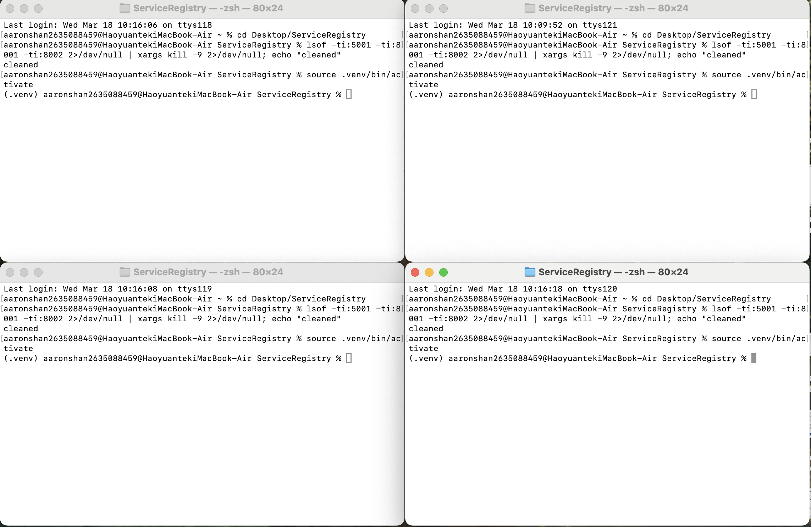
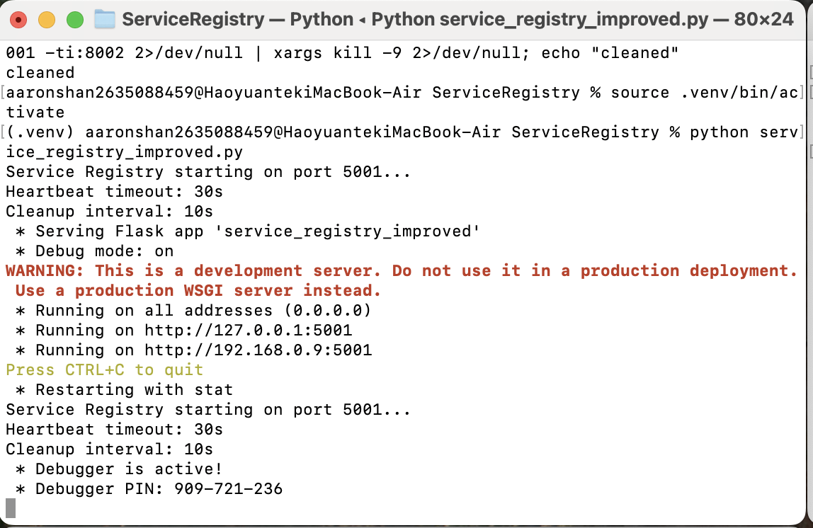
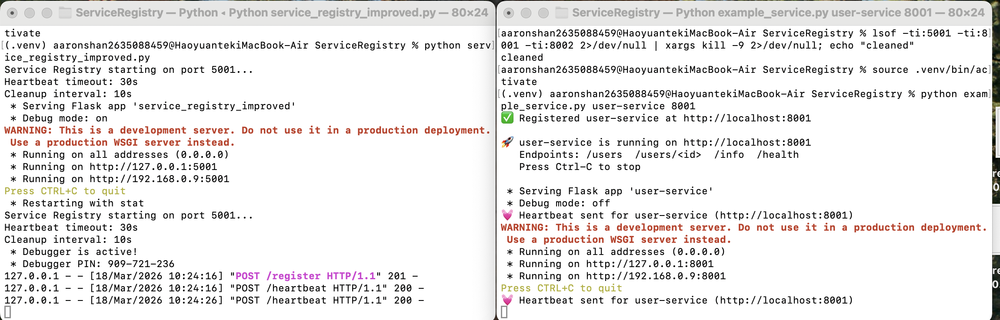
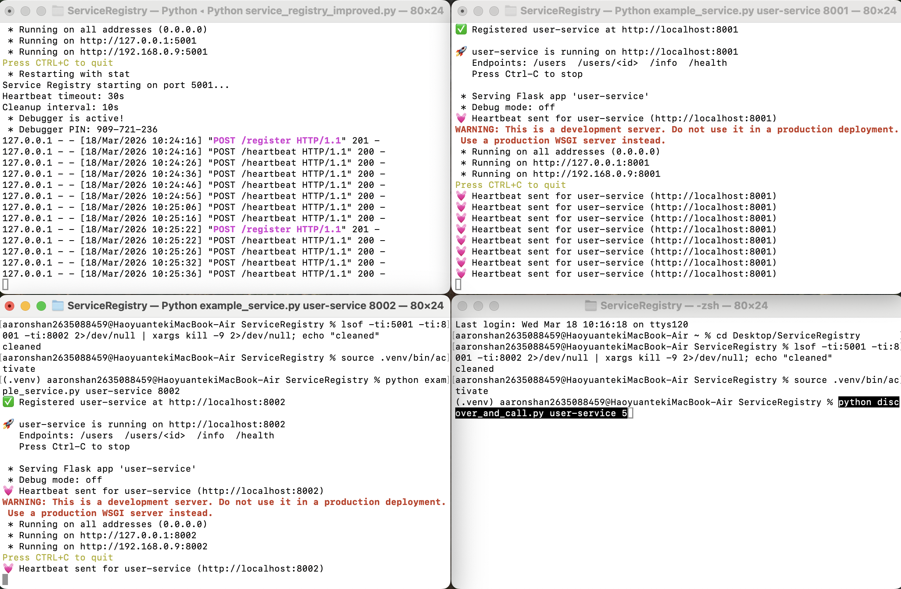
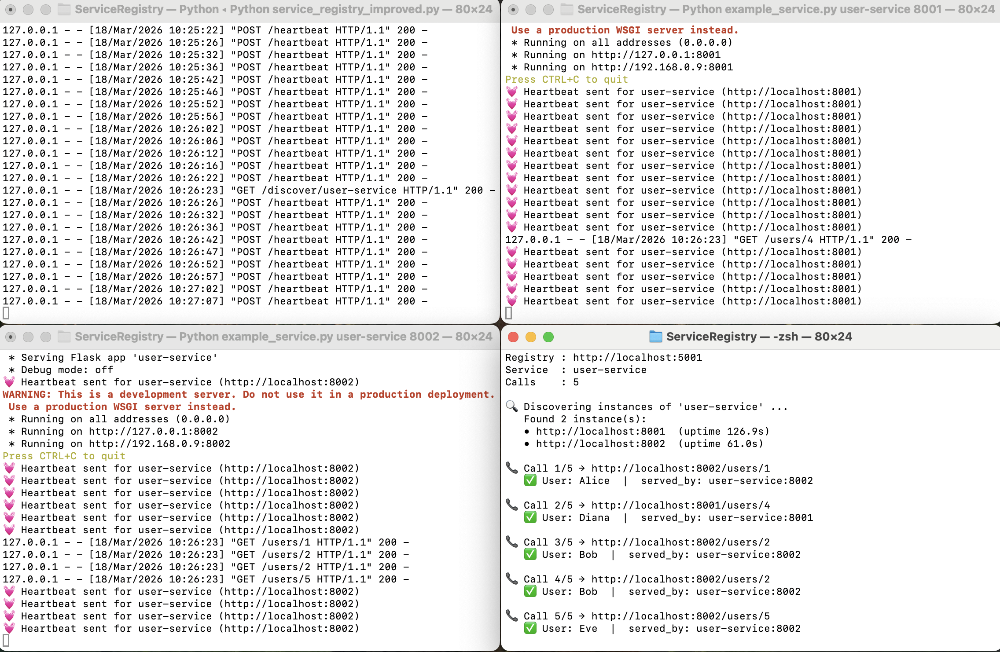
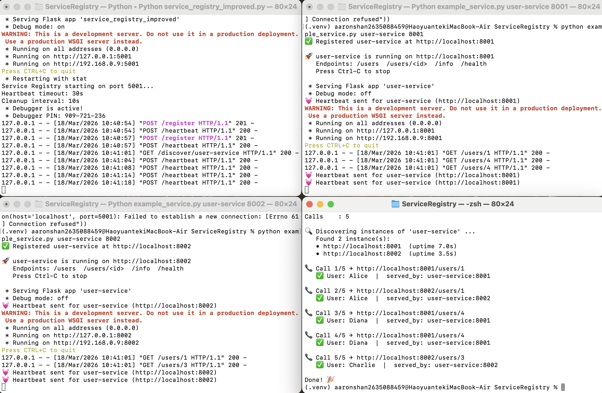
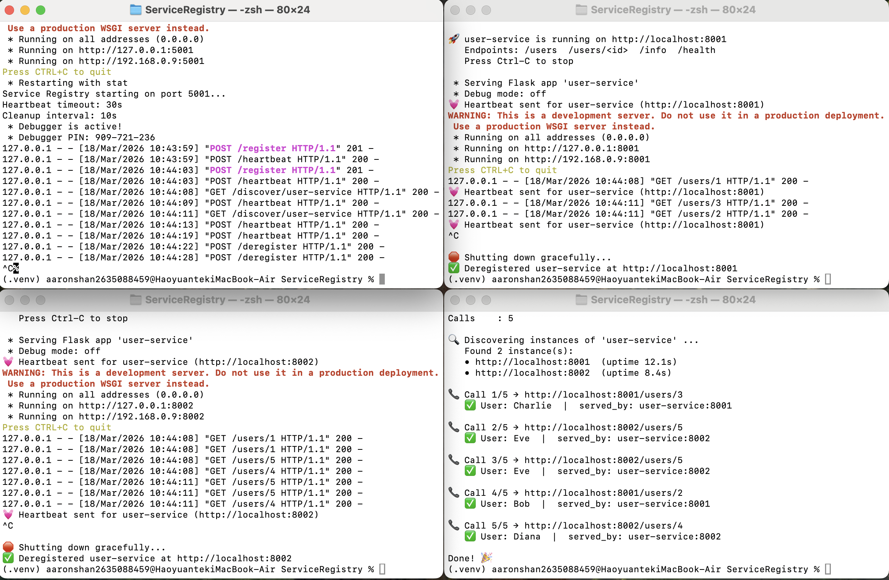
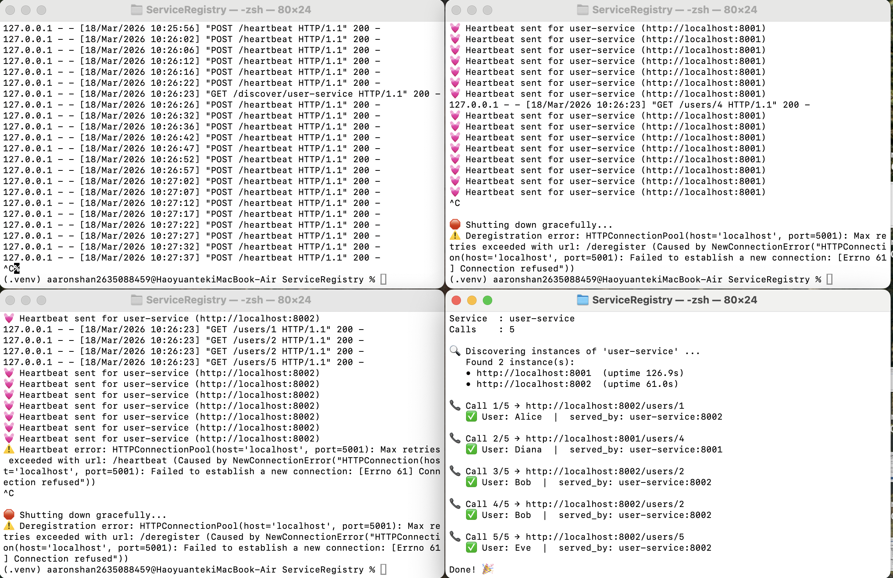

# Week 7 — Microservice with Service Discovery

## About This Project

We started with the starter code the professor gave us: [https://github.com/ranjanr/ServiceRegistry](https://github.com/ranjanr/ServiceRegistry).

The original repo had a bunch of things we didn't need for this assignment — like Consul, Kubernetes, Docker files, etc. So we cleaned it up: we kept the main registry server (`service_registry_improved.py`) since that's the core part, and removed everything else so the project is simpler and easier to follow.

Then we modified the example service so it actually does something — it serves user data (names, emails, etc.) instead of just registering. We also wrote a small client script that discovers services from the registry and calls a random one.

We didn't use Docker for this assignment since the main focus is on **service discovery** itself. Instead, we just run each service instance in a separate terminal — this way you can clearly see each instance registering, receiving requests, and the client randomly picking between them. It's more straightforward and easier to demo.

## Architecture

Here's a simplified overview of how everything connects:

```
              ┌─────────────────┐
              │ Service Registry │
              │   (port 5001)   │
              └───────▲─────────┘
                      │
         register/    │    register/
         heartbeat    │    heartbeat
            ┌─────────┼─────────┐
            │         │         │
     ┌──────┴──┐      │   ┌────┴─────┐
     │Instance1│      │   │Instance2 │
     │ :8001   │      │   │ :8002    │
     └─────────┘      │   └────▲─────┘
                discover│       │
              ┌────────┴─┐     │
              │ Discovery ├────┘
              │  Client   │ call random
              └───────────┘ /users/<id>
```

For a more detailed architecture breakdown — including request flow diagrams (registration, discovery, shutdown) and design decisions — see [ARCHITECTURE.md](ARCHITECTURE.md).

## Files

| File | Status | Description |
|------|--------|-------------|
| `service_registry_improved.py` | Kept (unchanged) | The registry server from the starter code. Runs on port 5001, handles registration, discovery, heartbeat, and auto-cleanup of dead instances. We didn't need to change anything here — it already worked well. |
| `example_service.py` | Modified | Originally this file only registered with the registry but didn't run an actual server. We rewrote it to start a Flask HTTP server with `/users`, `/users/<id>`, `/info`, and `/health` endpoints. It also sends heartbeats every 10s and deregisters on Ctrl-C. |
| `discover_and_call.py` | New | We created this file for the client side. It queries the registry to find all instances of a service, randomly picks one, and calls `/users/<id>` on it. This is how we demonstrate service discovery in action. |
| `requirements.txt` | Modified | Removed `python-consul` since we don't use Consul. Only `flask` and `requests` are needed now. |
| `ARCHITECTURE.md` | Modified | Rewrote with detailed flow diagrams showing registration, discovery, and shutdown sequences. |

## What We Changed

- **Rewrote `example_service.py`** — added a Flask HTTP server with `/users`, `/users/<id>`, `/info`, `/health` endpoints. Each response includes a `served_by` field showing which instance handled it.
- **Created `discover_and_call.py`** — queries the registry, picks a random instance, calls `/users/<id>`.
- **Removed** unneeded files: `service_registry.py`, `consul_client.py`, `Dockerfile`, `deploy-minikube.sh`, `quick_demo.sh`, Consul/K8s docs, and `k8s/` directory.

## How to Run

```bash
# Setup
python3 -m venv .venv
source .venv/bin/activate
pip install -r requirements.txt
```

Open 4 terminals:

```bash
# Terminal 1 — Registry
python service_registry_improved.py

# Terminal 2 — Instance 1
python example_service.py user-service 8001

# Terminal 3 — Instance 2
python example_service.py user-service 8002

# Terminal 4 — Discovery Client
python discover_and_call.py user-service 5
```

## Demo Screenshots

**1. Environment Setup**



**2. Start the Service Registry (port 5001)**



**3. Start Instance 1 (port 8001)**



**4. Start Instance 2 (port 8002)**



**5. Run the Discovery Client — discovers 2 instances and randomly calls them**



**6. Run it again — different random results each time**



**7. Graceful Shutdown — instances deregister themselves on Ctrl-C**



**8. Shut down the Registry**



As you can see, the client discovers both instances and calls are distributed between `:8001` and `:8002` randomly. Running it twice gives different results, which shows the random selection is working. When we shut down an instance with Ctrl-C, it deregisters itself so the registry stays clean.

## How Discovery Works


1. **The service instances don't know about each other.** Instance 1 (port 8001) and Instance 2 (port 8002) both start independently. They don't hardcode each other's address anywhere. The only thing they know is the registry's address (`localhost:5001`).

2. **Each instance registers itself.** When an instance starts up, it sends a `POST /register` to the registry saying "hey, I'm `user-service` and I'm at `http://localhost:8001`." The registry stores this in memory.

3. **The client doesn't know where the services are either.** Our discovery client (`discover_and_call.py`) doesn't hardcode any service address. Instead, it asks the registry: `GET /discover/user-service` — "give me all the instances of user-service."

4. **The registry responds with a list.** It returns something like: `[{address: "http://localhost:8001"}, {address: "http://localhost:8002"}]`. Now the client knows where to go.

5. **The client picks one at random.** Using `random.choice()`, it picks one instance and calls `/users/<id>` on it. This is basically **client-side load balancing** — the client decides which instance to hit.

6. **`served_by` proves it works.** In the response, the `served_by` field shows which instance actually handled the request. If you run it multiple times, you'll see it switch between `:8001` and `:8002` — that's discovery in action.


