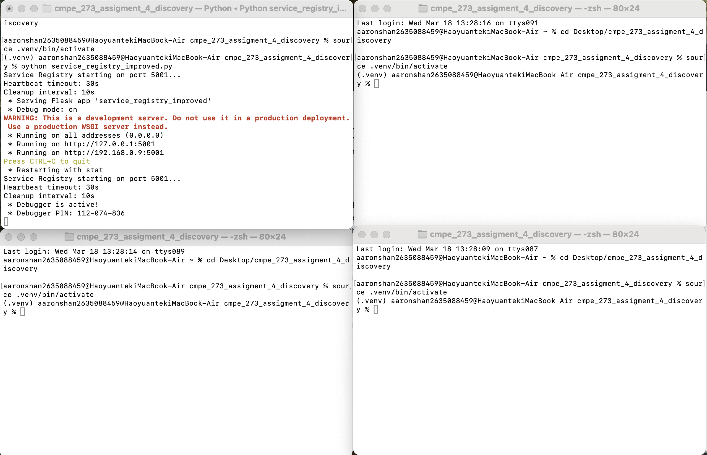
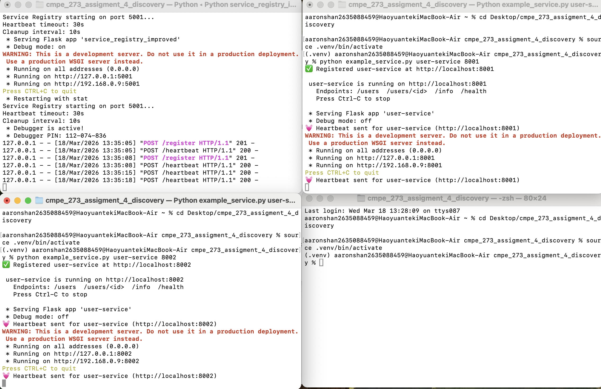
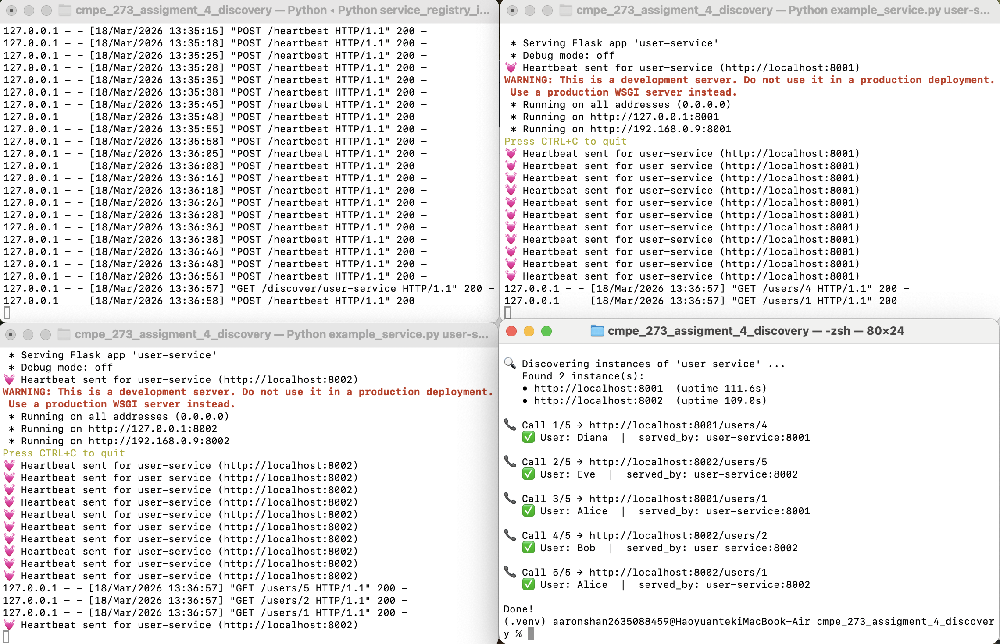
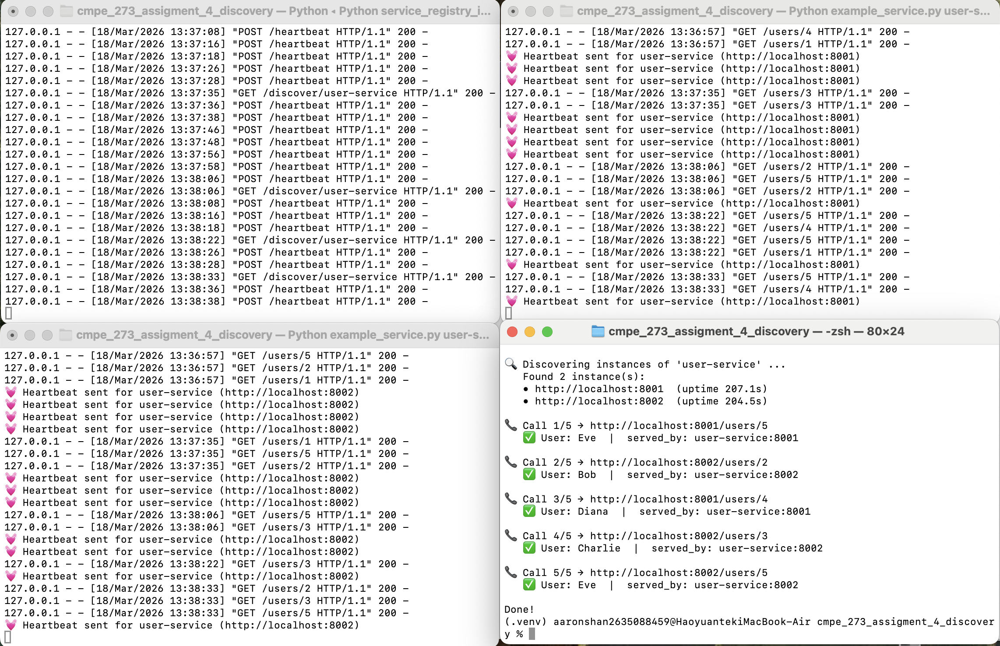
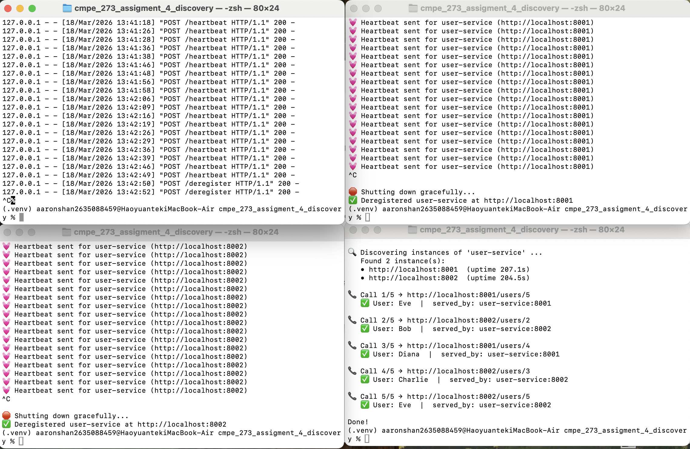
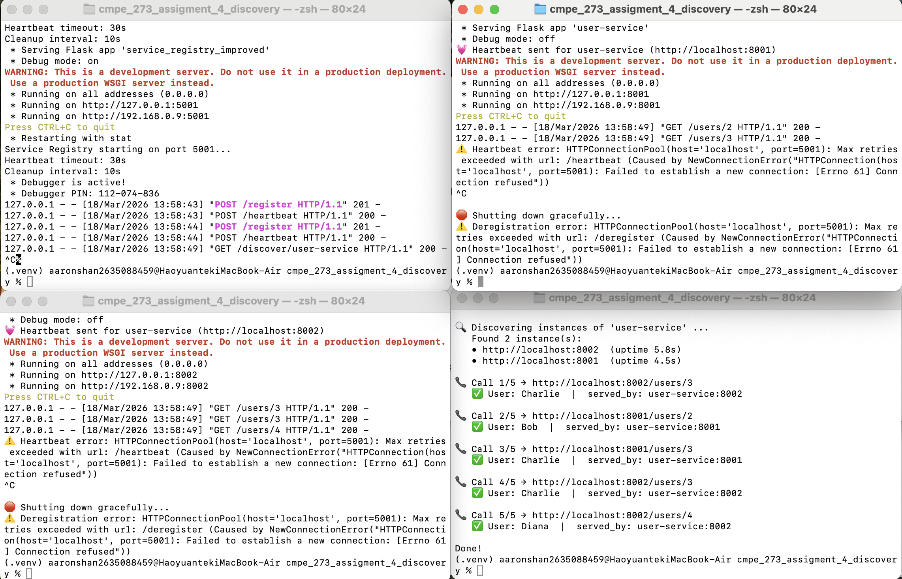

# Week 7 — Microservice with Service Discovery

## About this project

Our professor gave us this starter repo: [https://github.com/ranjanr/ServiceRegistry](https://github.com/ranjanr/ServiceRegistry). It had a lot of extra stuff I didn't need — Consul configs, Kubernetes manifests, Docker files, etc. I stripped all of that out and just kept the registry server (`service_registry_improved.py`).

After that I changed `example_service.py` so it actually runs a Flask server and returns user data. I also wrote a little client script (`discover_and_call.py`) that talks to the registry, finds running instances, and hits one of them.

I'm not using Docker here because the whole point of this assignment is just **service discovery**. Running everything in separate terminals makes it way easier to see what's going on.

## Architecture

Quick diagram of the setup:

```
              ┌─────────────────┐
              │ Service Registry │
              │   (port 5001)   │
              └───────▲─────────┘
                      │
         register/    │    register/
         heartbeat    │    heartbeat
            ┌─────────┼─────────┐
            │         │         │
     ┌──────┴──┐      │   ┌────┴─────┐
     │Instance1│      │   │Instance2 │
     │ :8001   │      │   │ :8002    │
     └─────────┘      │   └────▲─────┘
                discover│       │
              ┌────────┴─┐     │
              │ Discovery ├────┘
              │  Client   │ call random
              └───────────┘ /users/<id>
```

Check out [ARCHITECTURE.md](ARCHITECTURE.md) if you want the full breakdown with flow diagrams.

## Files

| File | What it does |
|------|-------------|
| `service_registry_improved.py` | Registry server from the starter code. Listens on port 5001. I kept it as-is since it already worked fine. |
| `example_service.py` | I turned this into a real Flask app with `/users`, `/users/<id>`, `/info`, `/health` routes. It sends heartbeats and deregisters on Ctrl-C. |
| `discover_and_call.py` | New file I wrote. It asks the registry for instances, picks one randomly, and calls `/users/<id>`. |
| `requirements.txt` | Just Flask and requests. I took out `python-consul` since I don't need it. |
| `ARCHITECTURE.md` | I rewrote this with diagrams for registration, discovery, and shutdown flows. |

## What I changed

- Turned `example_service.py` into a Flask server with user data endpoints. Every response has a `served_by` field so you can tell which instance handled it.
- Wrote `discover_and_call.py` from scratch — it finds services through the registry and calls one.
- Deleted a bunch of files I didn't need: `service_registry.py`, `consul_client.py`, `Dockerfile`, shell scripts, K8s stuff, etc.

## How to run

First set up a venv and install dependencies:

```bash
python3 -m venv .venv
source .venv/bin/activate
pip install -r requirements.txt
```

Then open 4 terminals:

```bash
# Terminal 1 — start the registry
python service_registry_improved.py

# Terminal 2 — instance 1
python example_service.py user-service 8001

# Terminal 3 — instance 2
python example_service.py user-service 8002

# Terminal 4 — run the discovery client
python discover_and_call.py user-service 5
```

## Output

1. Setting up the venv


2. Starting the registry (port 5001)



3. Starting instance 1 (port 8001) and instance 2 (port 8002)



4. Running the discovery client — it finds both instances and picks one



5. Running it again — different results each time



6. Shutting down both instances — they deregister themselves



7. Shutting down the registry



You can see in the output that the client picks between `:8001` and `:8002` randomly. Each run gives different results. When you Ctrl-C an instance, it removes itself from the registry so nothing breaks.

## How discovery works

None of the service instances know about each other. They each just know the registry's address (`localhost:5001`).

When an instance starts, it tells the registry "hey I'm here" by sending a POST to `/register`. The registry saves it.

The client doesn't know where the services are either. It just asks the registry: GET `/discover/user-service` — and the registry gives back a list of addresses like `http://localhost:8001` and `http://localhost:8002`.

Then the client picks one at random using `random.choice()` and sends a request to `/users/<id>`. The response has a `served_by` field so you can see which instance actually handled it. If you run it a few times you'll see it bounce between the two instances — that's basically client-side load balancing.


